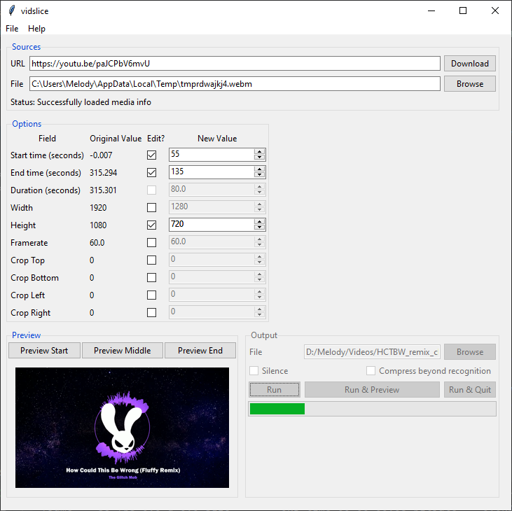

# vidslice

video manipulator wrapping youtube-dl and ffmpeg

## Installing
Download the .zip for your preferred OS [here](https://github.com/boringcactus/vidslice/releases/latest).
You may also need to [download ffmpeg](https://ffmpeg.org/download.html#get-packages) (if you're on Windows, you want Windows Builds and then the default options are fine) and [download youtube-dl](https://rg3.github.io/youtube-dl/download.html).
Both of those will give you some executables; you can place them in the same folder as your downloaded vidslice.exe and that should work.
